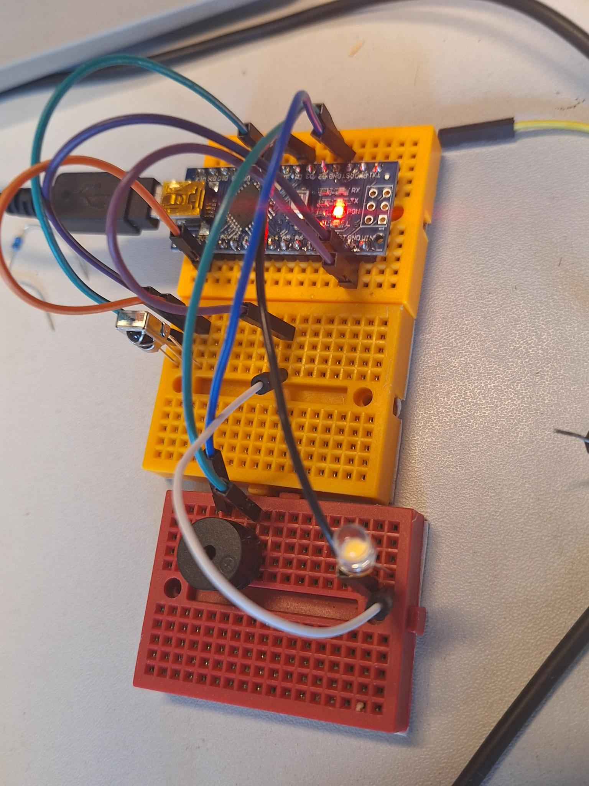

# Tentslot

Tentslot is een knutselproject om je tent op slot te kunnen zetten. Of in ieder geval zo te doen alsof.  

We willen:  
- 2-4 lampjes
- controller
- geluidsfunctie
- autosleutel

De controller ontvangt een signaal van de autosleutel en stuurt dan zowel de lampjes als ook het [geluid](./bleep.ino) (geïnspireerd door [geluid](https://www.youtube.com/watch?v=xSc9xaLkxng)) aan. De lampjes worden met magneten aan de tent bevestigd.  

Het simpelste idee is alleen met een frequency analyser uit te lezen of er een signaal is rond 433,92 MHz wat voor Europeese auto's met een [remote keyless system](https://en.wikipedia.org/wiki/Remote_keyless_system) gebruikt wordt.  

## Prototype

Hier een prototype met IR ipv RF en een Arduino Nano:  
